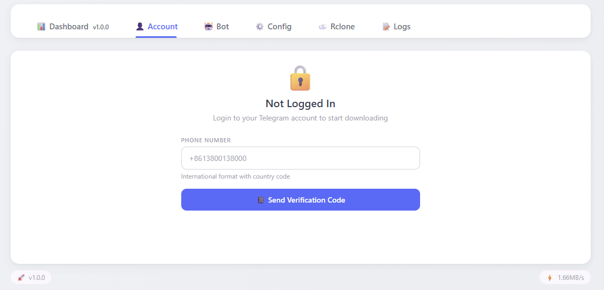

# Telegram Media Downloader

Thanks to the original author [tangyoha/telegram_media_downloader](https://github.com/tangyoha/telegram_media_downloader) for their open-source contribution.

This project is a Docker-based refactor of the original — no Python installation needed, just `docker compose pull` and run.

Image hosted at [`ghcr.io/akapzg/tg_downloader`](https://github.com/akapzg/TG_downloader/pkgs/container/tg_downloader). Use `latest` for stable or `v*` tags for specific releases.

[中文 README](README_CN.md)

## Overview
Automated Telegram media downloader with modern Web UI. Docker one-click deploy, multi-arch support (amd64/arm64).



## Deployment

### Prerequisites
*   Docker and Docker Compose installed.

### Quick Start

```bash
mkdir -p ~/tg_downloader && cd ~/tg_downloader && wget https://raw.githubusercontent.com/akapzg/TG_downloader/master/docker-compose.yaml
touch config.yaml data.yaml   # required: Docker bind-mount creates directories if files are missing
docker compose pull && docker compose up -d
```

On first start, `config.yaml` and `data.yaml` are populated from templates.
Access `http://<Server-IP>:5000` to continue setup.

## First-Time Setup

All configuration can be done through the Web UI after login — no SSH needed.

### 1. Web UI Login
Find the auto-generated password in Docker logs:
```bash
docker compose logs | grep SECURITY
```
Or set a fixed password in `docker-compose.yaml`:
```yaml
environment:
  - WEB_LOGIN_SECRET=your_password_here
```
Session expires after 30 minutes of inactivity.

### 2. API Credentials
Required for Telegram connection. Obtain from [my.telegram.org](https://my.telegram.org/apps):
1. Log in with your Telegram account
2. Go to API development tools
3. Create an application (any name)
4. Copy **api_id** and **api_hash**

Enter them in the Web UI under the **Config** tab and save. Restart the container to apply:
```bash
docker compose restart
```

### 3. Telegram Account Login
After setting API credentials and restarting:
1. Go to the **Account** tab
2. Enter your phone number in international format (+8613800138000)
3. Enter the verification code sent to your Telegram app
4. If 2FA is enabled, enter your two-factor password

### 4. Bot Configuration (Optional)
Configure a Telegram bot to control downloads remotely:
1. Go to the **Bot** tab
2. Enter the bot token from [@BotFather](https://t.me/BotFather)
3. Add allowed user IDs (comma/space/newline separated)
4. Save — changes take effect after restart

### 5. Cloud Upload (Optional)
Upload downloaded files to cloud storage via rclone. Because a headless server/Docker container usually lacks a web browser for OAuth authentication, it's highly recommended to configure Rclone on your personal computer first:
1. Download and install Rclone on your local Windows/Mac.
2. Run `rclone config` in your local terminal to create a new remote (e.g., named `my_drive`). Select your cloud provider (Google Drive, OneDrive, etc.) and complete the browser authentication.
3. Locate the generated `rclone.conf` file on your local computer and copy it to the `./rclone/` directory on your server.
4. Go to the **Rclone** tab in the Web UI.
5. Enable cloud upload, set the remote directory (e.g., `my_drive:/telegram_downloads` — the name must match what you created).
6. Save — changes take effect after restart.

*(Alternatively, run `docker exec -it tg_downloader rclone config` on the server and use the headless authentication flow).*

## Maintenance

*   **View Logs**:
    ```bash
    docker compose logs -f
    ```
    Or use the **Logs** tab in the Web UI.
*   **Update**:
    ```bash
    docker compose pull
    docker compose up -d
    ```

## Features
*   **Modernized UI** — Tailwind CSS, login integrated into the main page
*   **Auto-logout** — 5-minute session expiry
*   **Web Configuration** — API credentials, bot settings, rclone all configurable from the UI
*   **Containerized** — Multi-arch Docker (amd64/arm64), one-command deploy
*   **Auto-init** — Missing config files are created on first start
